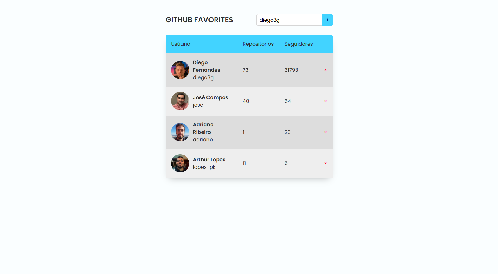

# 🚀 Git Hub Favorites

 
## 📖 Descrição
Projeto desenvolvido para praticar e aprimorar habilidades com **HTML**, **CSS** e, principalmente, **JavaScript**, **utilizando POO (Programação Orientada a Objetos)** e consumindo uma **API REST**. O design foi criado pela **Rocketseat** no **Figma**.

## 🚀 Tecnologias Utilizadas
- ✅ **HTML** 
- ✅ **CSS**
- ✅ **JavaScript**

## ⚡ Como Rodar o Projeto
Clone este repositório.
Acesse o diretório do projeto.
Abra o arquivo ***index.html*** no navegador ou utilize o plugin **Live Server** no VS Code.
